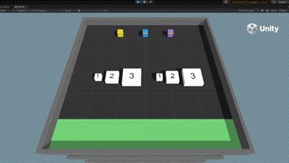
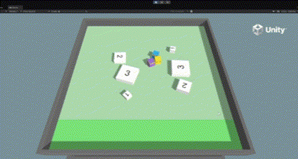

# Reward Design for Multi-Agent Cooperation in Unity

[中文说明](README.zh-CN.md) · [Presentation](docs/presentation/FinalPresentationSlides.pdf) · [Reward design](docs/reward-design.md) · [Reproduction guide](docs/reproduction.md)

A curated archive of a **2025 UCL Architectural Computation group project for Digital Ecologies**, adapting Unity ML-Agents' Cooperative Push Block example to explore how participation rules express cooperation preferences in a physics-based task.

**Team:** Du Hao, Gu Rui, Lu Haiyu, Pan Lingfeng.

**Gu Rui's contribution:** cooperation hypotheses, custom reward design, C# contribution tracking, and the later absolute-deviation reward formulation. Subsequent quantitative analysis, environmental tuning and performance comparisons were handled by teammates and are not claimed as Gu Rui's individual contribution. See [contribution boundaries](docs/contributions.md).

**Status:** historical code, scene exports and training artifacts, organized in October 2026. This is **not a standalone Unity project**; no Editor compilation, inference or training was performed during this organization pass. CSV calculations can be rerun with standard Python.

## Research question

Can a group reward encode a preference for assigning a suitable number of agents to each block type, beyond rewarding goal entry alone?

Three agents push blocks into a goal zone. Block types are assigned target participation counts of one, two and three. These are design targets, not experimentally established physical lower bounds. The original Unity example already provides group rewards and a time penalty; this project's logic adds participation matching.

## Reward variants

| Variant | Code listing | Participation estimate |
|---|---|---|
| Piecewise matching | [src/piecewise](src/piecewise) | Collision records and a recent-contribution time window |
| Absolute-deviation adjustment | [src/absolute_deviation](src/absolute_deviation) | Proximity, velocity direction and a step window |

The later formulation uses base goal score `s`, target count `k` and detected count `n`:

```text
correction = 1 - 0.5 * abs(k - n)
group_reward = (s + correction) / 2
```

For fixed `s`, each additional agent of mismatch reduces the goal-event reward by 0.25. Counts are discrete and rewards occur on goal events; “continuous” in the slides does not mean dense per-step feedback or continuous actions.

Historical issues are preserved, including the early mismatch branch giving positive rewards for excess participants, slide/source coefficient differences, and the limits of participation as a cooperation proxy. See [reward design and limitations](docs/reward-design.md). No behavioral fixes were silently applied to the C# code.

## Archived demonstrations

Illustrative course-archive clips; these are not controlled comparisons or quantitative evidence.

| Default-labeled clip | Customized-labeled clip |
|---|---|
|  |  |

## What the data supports

The archived analysis defines a match as `Used == Required`, excluding goal events with `Used == 0`. Retrospective standard-library reanalysis gives:

| Archive label | Valid goal events | Matching events | Participation-match rate |
|---|---:|---:|---:|
| Initial | 5,230 | 3,114 | 59.54% |
| Mass_Large | 4,880 | 3,044 | 62.38% |
| Mass_Light | 4,976 | 3,120 | 62.70% |
| Mass_Medium | 4,351 | 2,867 | 65.89% |

These are descriptive event rates, **not task completion speed, episode success rates or causal reward-design effects**. File labels do not establish a matched baseline or checkpoint-to-evaluation mapping. The records do not substantiate a 40% completion-efficiency improvement. See [evaluation notes](docs/evaluation.md) and [computed summaries](analysis/output/summary.csv).

## Repository layout

```text
src/piecewise/                Earlier standalone code listing
src/absolute_deviation/       Later standalone code listing
unity/exports/                Two separate scene exports, including .meta files
configs/training/             Saved configurations by archive run label
models/                       Top-level ONNX policies and evaluation models
experiments/training_status/  Checkpoint metadata where available
data/raw/                     Original goal-event CSVs
data/derived/                 Original processed CSVs
analysis/legacy/              Original pandas script
analysis/recompute_efficiency.py  Portable reanalysis added in 2026
analysis/output/              Recomputed results and validation receipt
docs/                         Slides, media, method and contribution notes
environment/                  Version references and external GUID inventory
archive_manifest.json         Source paths and SHA-256 checksums
LICENSES/                     Upstream license text
```

Code listings and scene scripts are separate historical copies and can differ. Import **one** Unity export at a time. Do not combine variants or add `src` alongside an export to Unity `Assets`: they define overlapping C# classes.

## Rerun the CSV analysis

From the repository root, using Python 3.8 or newer:

```bash
python analysis/recompute_efficiency.py
```

No third-party packages or GPU are needed. The script reads raw inputs, checks archived derived CSVs, and writes summaries and checksums to `analysis/output`. It does not train agents or modify raw data.

## Restore Unity

Historical local toolkit metadata identifies Unity **2021.3.11f1**, toolkit **release_20**, Python packages **0.30.0**, Unity ML-Agents **2.3.0-exp.3** and extensions **0.6.1-preview**.

The partial `PushBlock` exports omit the upstream project, packages and shared assets. Follow the [reproduction guide](docs/reproduction.md) to integrate one export into a separate upstream workspace and inspect references before inference or training. Saved models/configurations do not prove a correctly assembled scene.

## Provenance and scope

[Archive notes](docs/archive.md) explain source mapping, omissions and original 2025 versus retrospective 2026 work. Full PyTorch checkpoints, TensorBoard logs, Unity caches and unrelated coursework remain in the original local archive.

Unity's example and toolkit are third-party foundations; see [notices](THIRD_PARTY_NOTICES.md). This cleanup introduces no new blanket license for the group's original contributions.

## References

- [Unity ML-Agents release_20](https://github.com/Unity-Technologies/ml-agents/tree/release_20)
- [Cooperative group API documentation](https://github.com/Unity-Technologies/ml-agents/blob/release_20/docs/Learning-Environment-Design-Agents.md)
- [Cohen et al., On the Use and Misuse of Absorbing States in Multi-agent Reinforcement Learning](https://arxiv.org/abs/2111.05992)

Human–AI urban simulation is a future research direction, not a validated project outcome.
